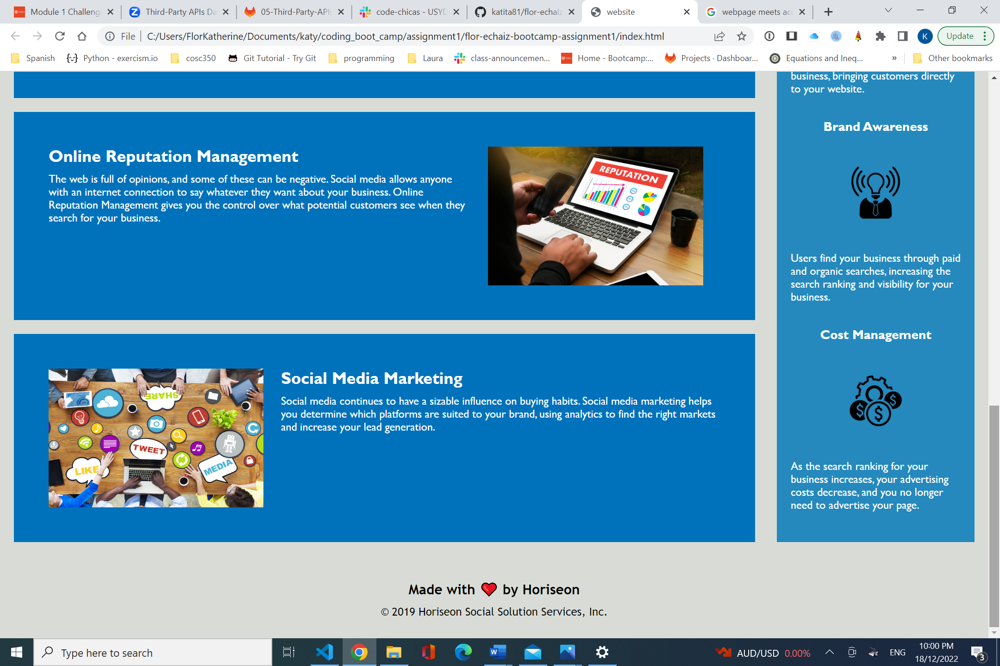

# Web Page Code Improvement

The code of the html and css files have been modified in order for the elements to fall in a sequential order, 
meet accessibility standards, find semantic HTML elements, see that the elements follow a logical structure
independent of styling and positioning, identify accessible alt attributes and a concise, descriptive title. The
code was also updated to easily view title elements, the structure
of the HTML elements, the image elements as well as the heading attributes.

Top part of the website
! [Top part of the website](imgs/topPartOfWebsite.png)

Middle part of the website
! [Middle part of the website](imgs/mediumPartOfWebsite.png)

Bottom part of the website

Live website: <https://katita81.github.io/flor-echaiz-bootcamp-assignment1>
